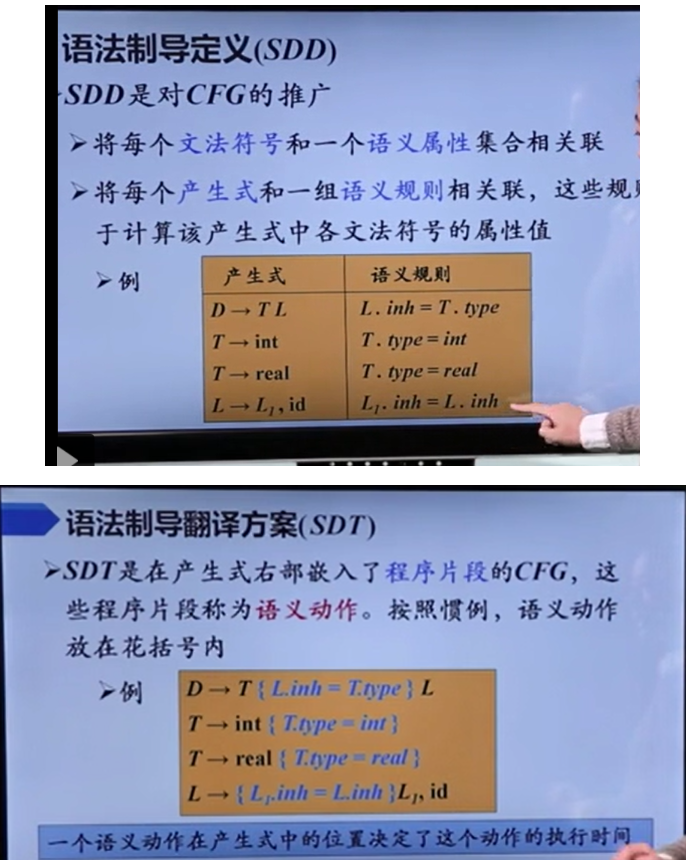
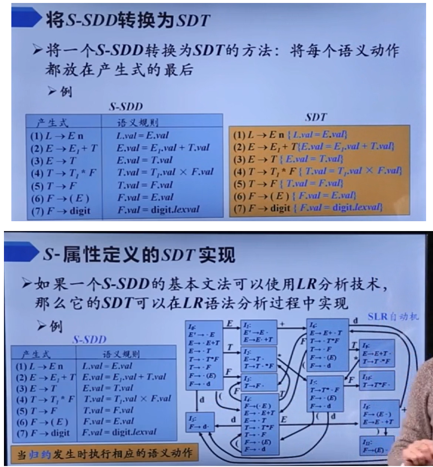

# lab1

词法分析状态机。

# lab2

## 理论基础

使用LR分析表进行归约时，sx表示入栈并且转移到状态x，rx表示用第x个产生式进行归约。每次分析流程大致如下：

1. 每次读取状态栈顶和输入首部字母，进行查表。

   【可以注意到每个稳定状态，状态栈和符号栈元素个数相同】

   【并且可以看到，如果想转移到某个状态，只需将其作为状态栈顶即可，设计巧妙】

   1. 若查出sx，则弹出首部字母，将其及其状态x入栈。
   2. 若查出rx，用第x个产生式归约符号栈（出栈符号及其对应状态，入栈归约结果），状态栈不变。
   3. 若查到GOTO表，则将其状态x入栈。

2. 重复1，直到得到acc。

## 代码框架

这里比较有意思的一个点是，它采用了个观察者模式，用来将相关的statistics输出。

它这个LRtable相关接口比较复杂，不过理解了还是问题不大。

# lab3

在自底向上的语法分析过程中，通过观察者模式，实现基于S-SDD的SDT语义分析和中间代码生成。语义分析也即更新符号表，填入所有变量对应的类型；

## 理论基础

## 感想

本次实验如果对之前的自底向上语法分析已经忘光了，且也不怎么懂SDT，那会是比较折磨的（）不过好在，确实在写完了符号表构建之后，之后的就逐渐得心应手顺风顺水了。加上速通学习SDD和完成实验，大约花了一晚上，也即4~5个小时的时间。

感觉一点很好的事，本次实验切身实际地带我们体会了一把语义分析，这也是我觉得写完了之后最兴奋的一章，因为这过程实在是太帅了，我对之后速通编译原理越来越期待了。

# lab4

本次实验是通过中间代码生成实际的riscv汇编代码，由于不涉及什么优化，所以实现起来也比较简单，实验时间纯纯地看打字速度（）

只实现了基础功能。