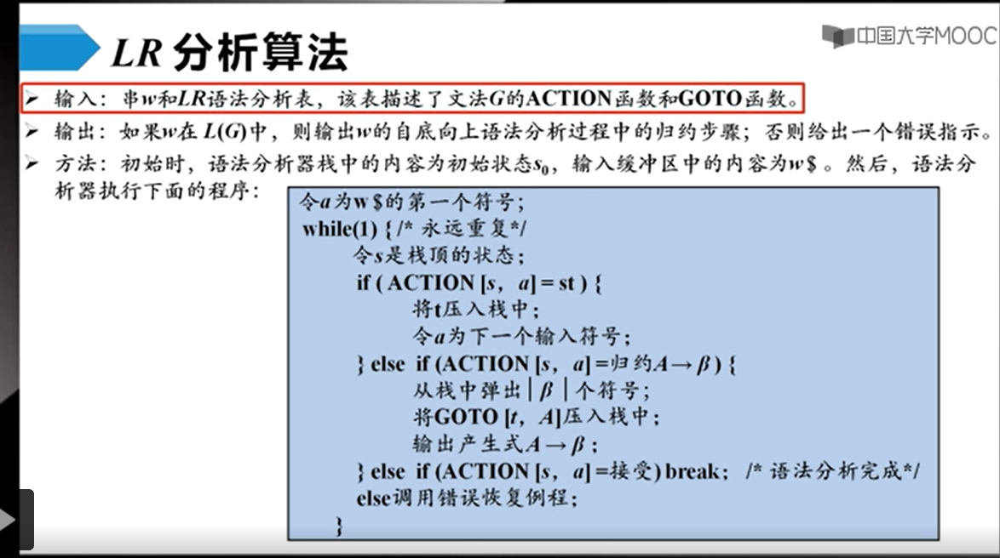
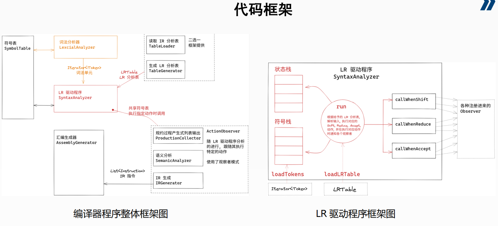

# lab1

词法分析状态机。

# lab2

## 理论基础

使用LR分析表进行归约时，sx表示入栈并且转移到状态x，rx表示用第x个产生式进行归约。每次分析流程大致如下：

1. 每次读取状态栈顶和输入首部字母，进行查表。

   【可以注意到每个稳定状态，状态栈和符号栈元素个数相同】

   【并且可以看到，如果想转移到某个状态，只需将其作为状态栈顶即可，设计巧妙】

   1. 若查出sx，则弹出首部字母，将其及其状态x入栈。
   2. 若查出rx，用第x个产生式归约符号栈（出栈符号及其对应状态，入栈归约结果），状态栈不变。
   3. 若查到GOTO表，则将其状态x入栈。

2. 重复1，直到得到acc。

## 代码框架

这里比较有意思的一个点是，它采用了个观察者模式，用来将相关的statistics输出。

它这个LRtable相关接口比较复杂，不过理解了还是问题不大。